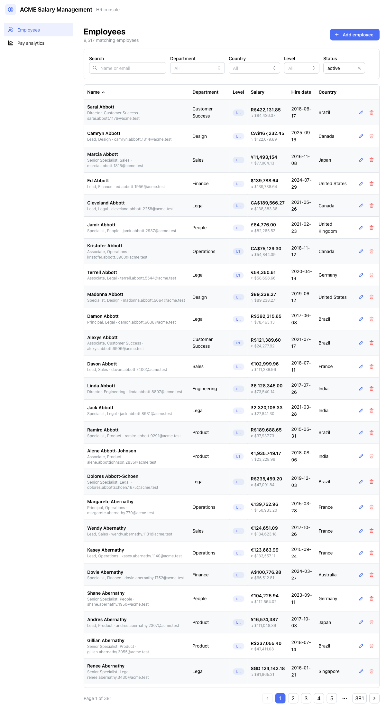

# ACME Salary Management

Web software for ACME's **HR Manager** to manage salary data for **10,000
employees across multiple countries** and answer the question _"how do we pay
people?"_ — replacing spreadsheets. Built for the Incubyte "Software
Craftsperson Node/TypeScript/ReactJS — II" assessment.

> **Live demo:** _API_ → `<render-url>` · _Web_ → `<vercel-url>` (filled in after deploy)
>
> **Screenshots:** [`docs/screenshots/`](docs/screenshots) · **Demo video:** `<link>`



## What it does

- **Employee records** — create, view, edit, delete, with validation.
- **Directory at scale** — server-side search, filter (department / country /
  level / status), sort, and pagination that stays fast at 10k rows.
- **Pay analytics** — headcount, total payroll, average & median salary,
  breakdowns by department / country / level, and a salary distribution
  histogram — all normalized to **USD** for cross-country comparison.

See [`docs/REQUIREMENTS.md`](docs/REQUIREMENTS.md) for scope and the reasoned
list of what was deliberately left out.

## Tech stack

| Layer    | Choice                                                            |
| -------- | ----------------------------------------------------------------- |
| Backend  | Node + TypeScript, **Express** (routes → services → repositories) |
| Database | **SQLite** + **Prisma** (integer minor-unit money)                |
| Frontend | **React** + Vite + **Mantine** + TanStack Query + Mantine Charts   |
| Shared   | **Zod** schemas → TS types (one contract for client + server)     |
| Tests    | **Vitest** + Supertest + React Testing Library                    |

Architecture and trade-offs: [`docs/ARCHITECTURE.md`](docs/ARCHITECTURE.md) and
the ADRs in [`docs/adr/`](docs/adr). How AI was used:
[`docs/AI-USAGE.md`](docs/AI-USAGE.md).

## Quick start

Prerequisites: **Node ≥ 20** and **pnpm 9** (`corepack enable`).

```bash
pnpm install                      # install all workspaces
pnpm --filter @salary/api db:setup  # migrate + generate client + seed 10k employees
pnpm dev                          # API on :4000, web on :5173
```

Then open the web app, or hit the API directly:

```bash
curl localhost:4000/api/health
curl "localhost:4000/api/employees?pageSize=5&department=Engineering"
curl localhost:4000/api/analytics/summary
```

## Project layout

```
apps/
  api/    Express API — domain/ services/ repositories/ http/, prisma/ (schema + seed)
  web/    React SPA — pages/ components/ api/ lib/
packages/
  shared/ Zod schemas + inferred types shared by api and web
docs/     requirements, PRD, architecture, ADRs, AI-usage, screenshots
.claude/  project agents, commands, and a skill encoding these conventions
```

## Common commands

| Command | What it does |
| --- | --- |
| `pnpm dev` | Run API + web in watch mode |
| `pnpm test` | Run every workspace's test suite |
| `pnpm --filter @salary/api test` | API tests only (unit + SQLite integration) |
| `pnpm --filter @salary/web test` | Web tests only |
| `pnpm typecheck` | Type-check all workspaces |
| `pnpm --filter @salary/api db:seed` | (Re)seed 10,000 employees |
| `SEED_COUNT=500 pnpm --filter @salary/api db:seed` | Seed a smaller set |
| `pnpm build` | Production build of every package |

## Testing

84 tests, fast and deterministic. Pure domain logic and services are unit-tested
(services with a mocked repository interface); repositories and HTTP routes are
integration-tested against a throwaway SQLite database per file. Built strictly
test-first — the commit history shows the red → green → refactor evolution. See
[`docs/adr/0006-testing-strategy.md`](docs/adr/0006-testing-strategy.md).

```bash
pnpm test
```

## Deployment

API → Render, web → Vercel. Configuration is checked in (`render.yaml`,
`apps/web/vercel.json`). The database is SQLite; the production seed is
idempotent (seeds only an empty database). Full walkthrough lives in the
deployment guide.

## Money & currency

Salaries are stored in their native currency as **integer minor units** (no
floating-point money). Cross-org analytics normalize to USD via a checked-in
static rate table that honors each currency's real decimal places. See
[`docs/adr/0003-currency-normalization.md`](docs/adr/0003-currency-normalization.md)
and [`0005`](docs/adr/0005-money-as-integer-minor-units.md).
