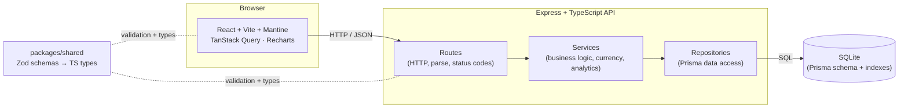
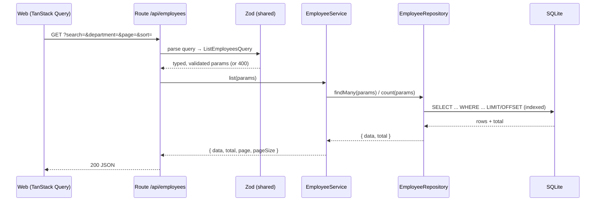

# Architecture

## System overview

## Layering & dependency rule

Dependencies point inward only: `routes → services → repositories → Prisma`.

- **Routes** know HTTP. They parse/validate input with shared Zod schemas, call a
  service, and translate results/errors into status codes. No business logic.
- **Services** know the domain. Pure-ish logic (currency normalization, analytics
  aggregation orchestration, invariants). They depend on a **repository
  interface**, not Prisma — which is what makes them unit-testable with a mock.
- **Repositories** know persistence. They are the only place Prisma is imported.
- **packages/shared** is the contract: one Zod schema defines both runtime
  validation and the compile-time type, shared by client and server so they
  can't drift.

## Request lifecycle (list employees)

## Key trade-offs

| Decision | Chosen | Trade-off | ADR |
| --- | --- | --- | --- |
| Backend shape | Express + layered services | Less batteries-included than NestJS, but minimal magic → the TDD story is explicit and easy to read. | [0001](adr/0001-architecture-express-react-monorepo.md) |
| Database | SQLite + Prisma | Single-writer, not for high-concurrency prod — but zero-infra, portable, and ample for 10k rows + one user. Prisma migration to Postgres is low-cost. | [0002](adr/0002-sqlite-prisma.md) |
| Currency | Store native, normalize via static FX table | Rates go stale; analytics are directional not accounting-grade — acceptable for HR planning and deterministic for tests. | [0003](adr/0003-currency-normalization.md) |
| List queries | Server-side pagination/filter/sort + indexes | More query plumbing than client-side filtering, but the only option that stays fast at 10k+ rows. | [0004](adr/0004-server-side-querying.md) |
| Money storage | Integer minor units (cents) | Slightly more conversion code, avoids floating-point rounding bugs entirely. | [0005](adr/0005-money-as-integer-minor-units.md) |
| Tests | Vitest; unit (mocked repo) + integration (temp SQLite) | Two harness styles to maintain, but fast deterministic unit tests + honest DB integration coverage. | [0006](adr/0006-testing-strategy.md) |

## Performance notes (10,000 employees)

- **Indexed columns:** `department`, `country`, `level`, `lastName`, `status` —
  every filter/sort path hits an index.
- **No full-table loads:** the API always paginates; the client requests one page
  at a time with `keepPreviousData` for flicker-free navigation.
- **Analytics in the database:** averages, counts, and group-bys run as SQL
  aggregation; median uses an ordered query. Salaries are summed/averaged in USD
  minor units (integers) to keep arithmetic exact.
- **Debounced search** avoids a request per keystroke.

## Where to extend

- **Auth:** add an auth middleware in `apps/api/src/http` and a login screen; the
  layering means services are unaffected.
- **Postgres:** change the Prisma datasource + connection string; repositories and
  services are unchanged.
- **Live FX:** replace the static map in `domain/currency.ts` with a cached rates
  client behind the same `toUsdMinor()` signature.
- **Comp components / history:** extend the `Employee` model and add a
  `SalaryChange` table; analytics services gain new aggregations.
